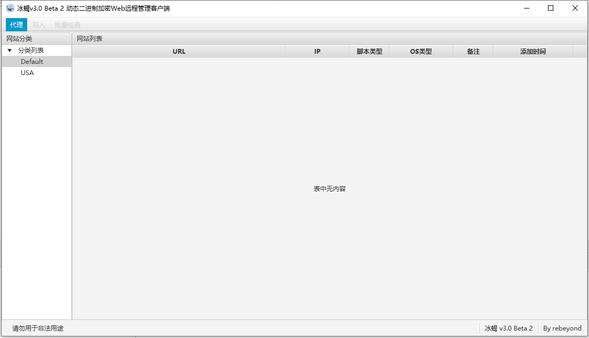

# Behinder3.0 Beta4 源码

冰蝎3.0Beta4的源码（Decompile &amp; Fixed）

为了让表哥们用的开心，进行了简单的逆向工程和修复

当然不能忘了支持原作者： [Behinder](https://github.com/rebeyond/Behinder)

## 目前进度

- | 时间          | 内容                                                         |
  | ------------- | ------------------------------------------------------------ |
  | 2020年8月18日 | 编译修复，暂未进行功能测试，如果有表哥能帮忙进行功能测试，感激不尽，同时把ASM升级到了最新版，不知道为啥原作者还在用3.3.1的老版本，但是我也没对升级之后的功能进行测试。 |
  | 2020年8月19日 | 同步更新Behinder v3.0 Beta4的代码，修复Payload无法加载的问题 |
  | 2020年9月1日  | 修复Linux支持，在Manjaro Gnome+OpenJDK8的环境下测试通过      |

## 运行截图



## Tips

### IDEA Gradle Console中文乱码解决方案

打开Help>Edit Custom VM Options

添加

-Dfile.encoding=UTF-8
解决

原文链接

https://intellij-support.jetbrains.com/hc/en-us/community/posts/360004976119-idea-build-console-display-Chinese-in-garbled-code

### Linux下无法识别JavaFX的问题

Linux下需要手动安装JavaFX

```
# Manjaro/ArchLinux
sudo pacman -S java8-openjfx

```
